# Capturas

## Interfaz Web

**Interfaz web captura 1**
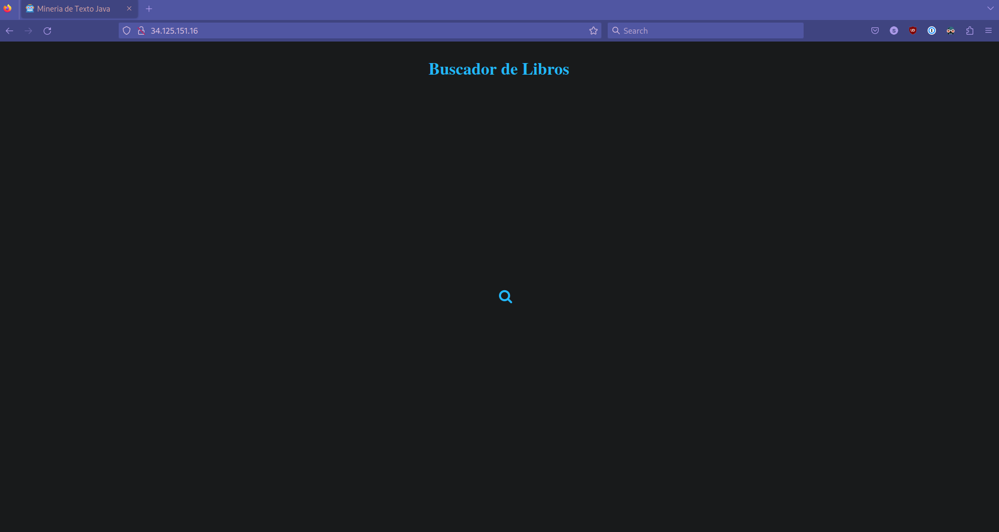 

**Interfaz web captura 2**
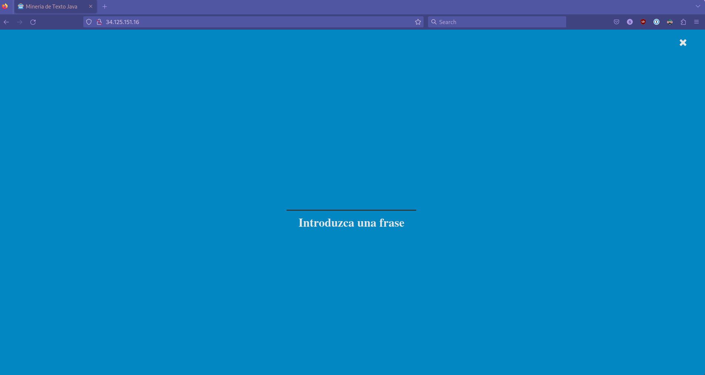 

**Interfaz web captura 3**
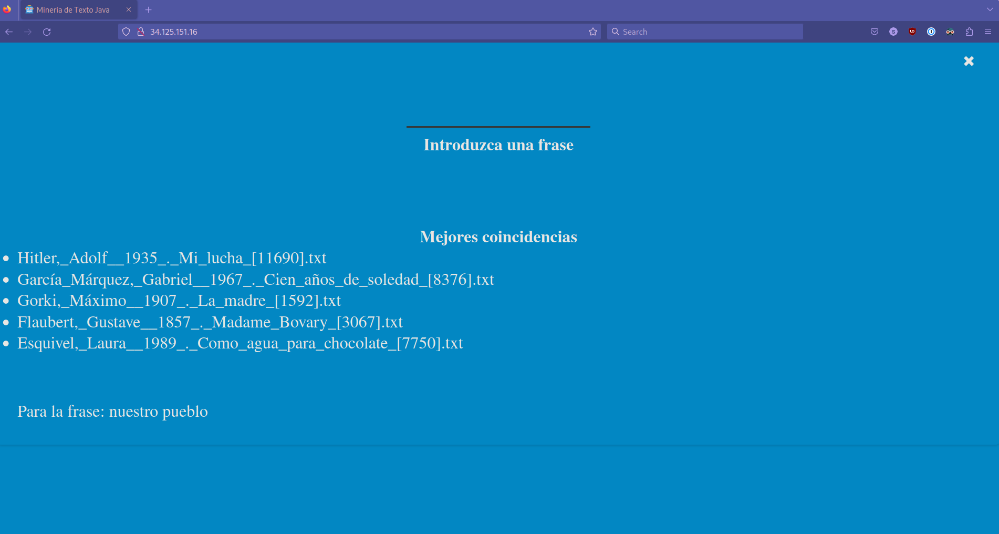 

## Funcionamiento en Terminal

**Ejecución con 3 nodos** 
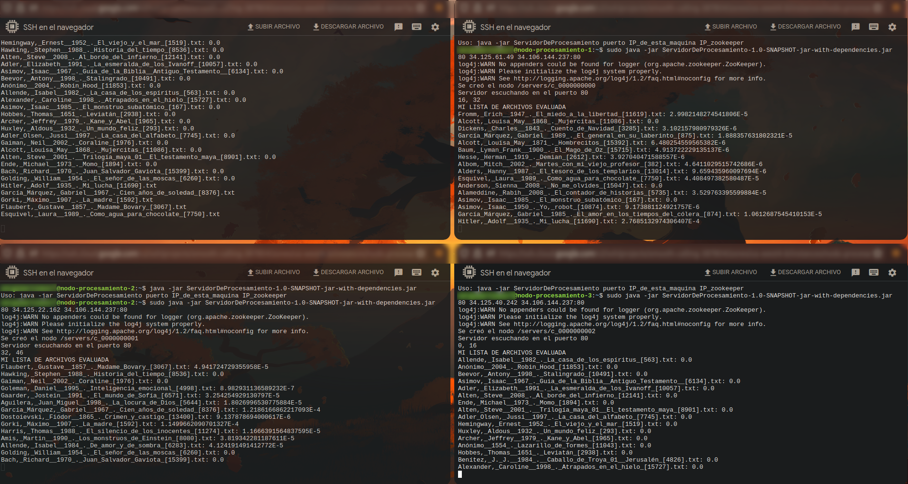 

**Ejecución con 2 nodos** 
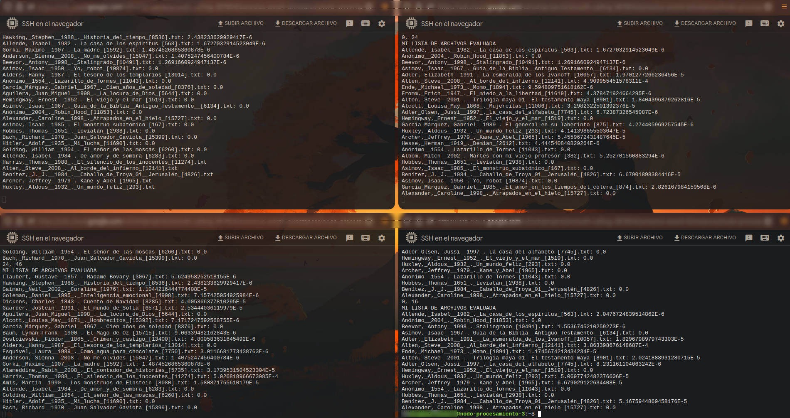 

**Ejecución con 1 nodo** 
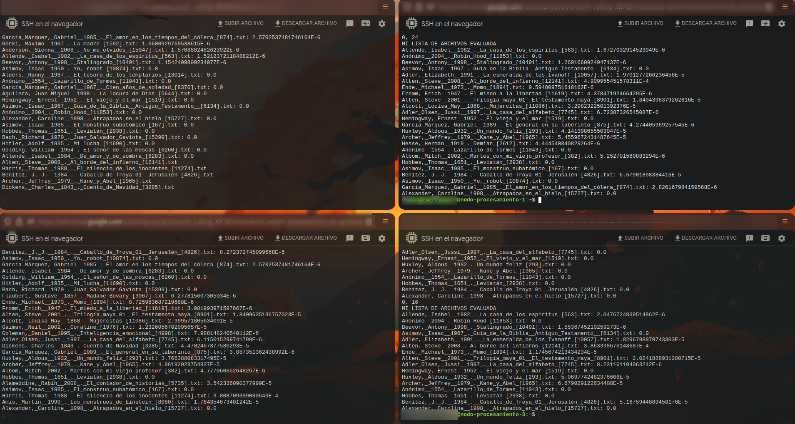 

**Web Server entregando los resultados a la interfaz** 
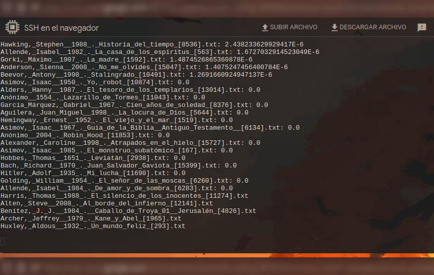

## Iniciar Servidores

**Ejemplo de inicio del servidor de zookeeper** 
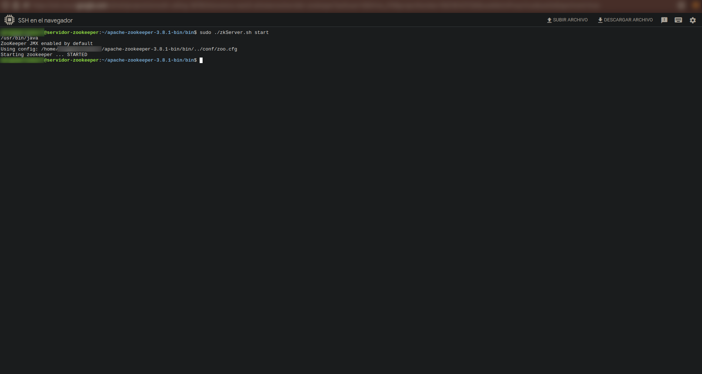

**Ejemplo de inicio del servidor web**
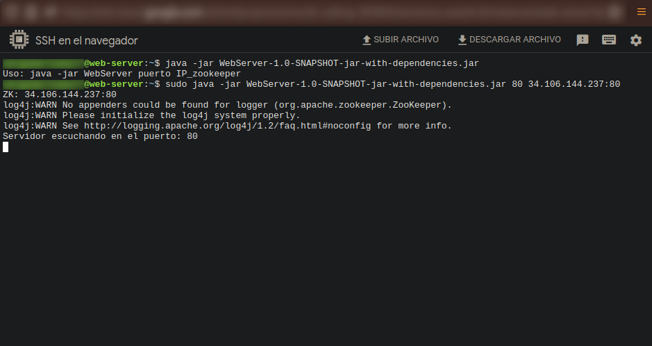

**Ejemplo de inicio de un nodo de procesamiento**
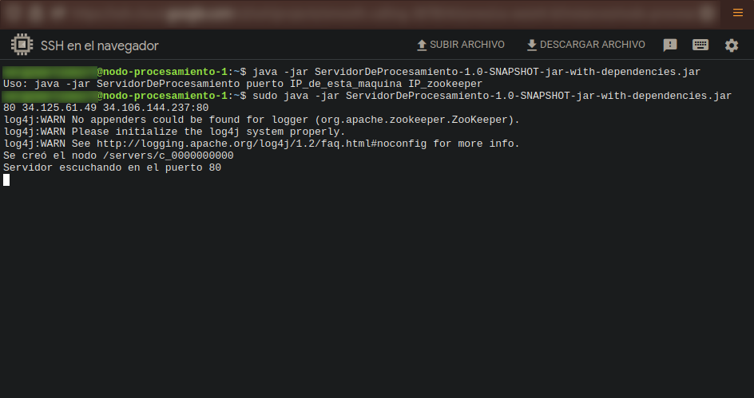

**Servidor web y nodos ejecutándose**
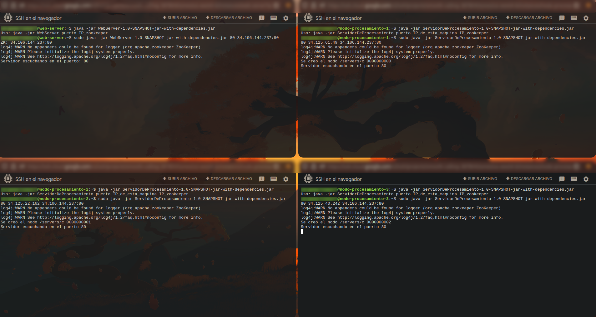
